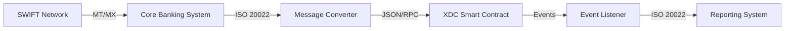

# ISO 20022 Integration

XDC Network is designed with ISO 20022 compatibility, enabling seamless integration with global financial messaging systems used by banks and financial institutions.

## What is ISO 20022?

ISO 20022 is the international standard for electronic data interchange between financial institutions. It provides:

- **Rich Data**: Structured, detailed payment information
- **Global Standard**: Adopted by SWIFT, central banks, and payment systems worldwide
- **Interoperability**: Seamless communication across different systems
- **Future-Ready**: Designed for modern financial needs

## Why ISO 20022 Matters for Blockchain

| Traditional Challenge | ISO 20022 + XDC Solution |
|----------------------|--------------------------|
| Limited payment data | Rich, structured message format |
| Incompatible systems | Universal messaging standard |
| Manual reconciliation | Automated straight-through processing |
| Compliance gaps | Complete audit trail |

## XDC Network ISO 20022 Features

### Message Compatibility

XDC Network supports mapping of key ISO 20022 message types:

| Message Type | Description | XDC Support |
|-------------|-------------|-------------|
| pacs.008 | Customer Credit Transfer | ✅ |
| pacs.009 | Financial Institution Transfer | ✅ |
| camt.053 | Bank Statement | ✅ |
| pain.001 | Payment Initiation | ✅ |
| head.001 | Business Message Header | ✅ |

### Technical Implementation

```xml
<!-- Example ISO 20022 pacs.008 mapped to XDC transaction -->
<Document xmlns="urn:iso:std:iso:20022:tech:xsd:pacs.008.001.08">
  <FIToFICstmrCdtTrf>
    <GrpHdr>
      <MsgId>XDC-20240127-001</MsgId>
      <CreDtTm>2024-01-27T10:00:00Z</CreDtTm>
      <NbOfTxs>1</NbOfTxs>
      <SttlmInf>
        <SttlmMtd>CLRG</SttlmMtd>
        <ClrSys>
          <Prtry>XDC</Prtry>
        </ClrSys>
      </SttlmInf>
    </GrpHdr>
    <CdtTrfTxInf>
      <PmtId>
        <EndToEndId>E2E-REF-12345</EndToEndId>
        <TxId>xdc7890abcdef1234567890abcdef1234567890ab</TxId>
      </PmtId>
      <IntrBkSttlmAmt Ccy="USD">10000.00</IntrBkSttlmAmt>
    </CdtTrfTxInf>
  </FIToFICstmrCdtTrf>
</Document>
```

### Smart Contract Integration

```solidity
// SPDX-License-Identifier: MIT
pragma solidity ^0.8.19;

contract ISO20022Payment {
    struct PaymentInstruction {
        bytes32 messageId;        // MsgId
        bytes32 endToEndId;       // EndToEndId
        address debtor;           // Dbtr
        address creditor;         // Cdtr
        uint256 amount;           // IntrBkSttlmAmt
        string currency;          // Ccy
        uint256 creationDateTime; // CreDtTm
        bytes32 purposeCode;      // Purp/Cd
    }
    
    mapping(bytes32 => PaymentInstruction) public payments;
    mapping(bytes32 => bool) public settled;
    
    event PaymentInitiated(bytes32 indexed messageId, address debtor, address creditor, uint256 amount);
    event PaymentSettled(bytes32 indexed messageId, bytes32 txHash);
    
    function initiatePayment(
        bytes32 _messageId,
        bytes32 _endToEndId,
        address _creditor,
        uint256 _amount,
        string calldata _currency,
        bytes32 _purposeCode
    ) external payable {
        require(!settled[_messageId], "Payment already exists");
        require(msg.value == _amount, "Amount mismatch");
        
        payments[_messageId] = PaymentInstruction({
            messageId: _messageId,
            endToEndId: _endToEndId,
            debtor: msg.sender,
            creditor: _creditor,
            amount: _amount,
            currency: _currency,
            creationDateTime: block.timestamp,
            purposeCode: _purposeCode
        });
        
        emit PaymentInitiated(_messageId, msg.sender, _creditor, _amount);
    }
    
    function settlePayment(bytes32 _messageId) external {
        PaymentInstruction storage payment = payments[_messageId];
        require(payment.amount > 0, "Payment not found");
        require(!settled[_messageId], "Already settled");
        
        settled[_messageId] = true;
        payable(payment.creditor).transfer(payment.amount);
        
        emit PaymentSettled(_messageId, blockhash(block.number - 1));
    }
}
```

## Integration Architecture



## Benefits for Financial Institutions

### Operational Efficiency
- **Straight-Through Processing**: Automated payment flows
- **Reduced Manual Intervention**: Less error-prone operations
- **Faster Settlement**: 2-second finality vs T+2

### Compliance & Reporting
- **Complete Audit Trail**: Every transaction recorded on-chain
- **Rich Data**: Detailed payment information for compliance
- **Real-Time Reporting**: Instant access to transaction data

### Cost Reduction
- **Lower Transaction Costs**: Near-zero XDC fees vs traditional fees
- **Reduced Reconciliation**: Automated matching
- **Eliminated Intermediaries**: Direct settlement

## Implementation Guide

### Step 1: Message Mapping
Map your existing ISO 20022 messages to XDC transaction format:

```javascript
const mapISO20022ToXDC = (isoMessage) => {
    return {
        to: isoMessage.CdtTrfTxInf.Cdtr.Id,
        value: parseFloat(isoMessage.CdtTrfTxInf.IntrBkSttlmAmt['#text']),
        data: {
            messageId: isoMessage.GrpHdr.MsgId,
            endToEndId: isoMessage.CdtTrfTxInf.PmtId.EndToEndId,
            currency: isoMessage.CdtTrfTxInf.IntrBkSttlmAmt['@Ccy']
        }
    };
};
```

### Step 2: Deploy Integration Layer
Set up middleware to convert between ISO 20022 and XDC:

```javascript
const express = require('express');
const Xdc3 = require('xdc3');
const xml2js = require('xml2js');

const app = express();
const xdc3 = new Xdc3('https://rpc.xinfin.network');

app.post('/payment', async (req, res) => {
    const isoMessage = await xml2js.parseStringPromise(req.body);
    const xdcTx = mapISO20022ToXDC(isoMessage);
    
    const receipt = await xdc3.eth.sendTransaction(xdcTx);
    
    // Generate ISO 20022 confirmation
    const confirmation = generatePacs002(receipt);
    res.send(confirmation);
});
```

### Step 3: Connect to Core Banking
Integrate with your core banking system via standard APIs or message queues.

## Resources

- [ISO 20022 Official](https://www.iso20022.org/)
- [SWIFT ISO 20022 Migration](https://www.swift.com/standards/iso-20022)
- [XDC RPC Documentation](../xdcchain/developers/rpc.md)
- [Smart Contract Templates](https://github.com/XinFinOrg)
