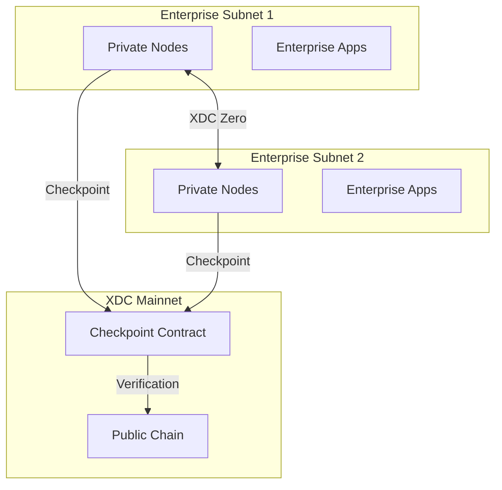

# Private Subnets for Enterprise

XDC Private Subnets enable enterprises to deploy dedicated, application-specific blockchains while maintaining interoperability with the XDC mainnet.

## Overview

Private Subnets are sovereign blockchain networks that:

- **Run independently** with customizable consensus parameters
- **Connect to XDC mainnet** for cross-chain communication
- **Maintain privacy** for sensitive enterprise data
- **Scale horizontally** for specific use cases

## Architecture



## Key Features

| Feature | Description |
|---------|-------------|
| **Sovereign Consensus** | Customize block time, validator set, and consensus rules |
| **Data Privacy** | Transaction data stays on your private network |
| **Mainnet Anchoring** | Periodic checkpoints to XDC mainnet for security |
| **Cross-Chain Bridge** | Transfer assets between subnet and mainnet |
| **Permissioned Access** | Control who can participate in the network |

## Use Cases

### Regulated Financial Services
Deploy a private subnet for banking operations where data privacy and regulatory compliance are paramount.

### Supply Chain Consortiums
Create a shared private network for supply chain partners with controlled access.

### Healthcare Data
Manage sensitive patient data with HIPAA-compliant private infrastructure.

### Government Applications
Deploy government services with full data sovereignty.

## Deployment Options

### Option 1: Fully Private
- All nodes operated by your organization
- Complete data isolation
- No external connectivity

### Option 2: Consortium
- Multiple organizations operate nodes
- Shared governance
- Permissioned participation

### Option 3: Hybrid
- Private execution layer
- Public verification via mainnet
- Selective data disclosure

## Quick Start

### Prerequisites
- Docker and Docker Compose
- Minimum 3 nodes for production
- XDC for mainnet checkpointing fees

### Deploy a Subnet

```bash
# Clone the subnet deployment tools
git clone https://github.com/XinFinOrg/XDC-Subnet.git
cd XDC-Subnet

# Configure your subnet
cp .env.example .env
nano .env

# Set your configuration
SUBNET_NAME=my-enterprise-subnet
BLOCK_TIME=2
VALIDATORS=3
CHECKPOINT_INTERVAL=900
```

### Configuration File

```yaml
# subnet-config.yaml
subnet:
  name: "Enterprise Subnet"
  chainId: 551 # Unique chain ID
  
consensus:
  type: "XDPoS"
  blockTime: 2
  epochLength: 900
  
validators:
  count: 3
  minStake: 10000000 # 10M XDC equivalent
  
checkpoint:
  enabled: true
  mainnetRPC: "https://rpc.xinfin.network"
  interval: 900 # blocks
  
network:
  p2pPort: 30303
  rpcPort: 8545
  wsPort: 8546
```

### Start the Network

```bash
# Initialize genesis
./scripts/init-genesis.sh

# Start validator nodes
docker-compose up -d

# Verify network
curl -X POST http://localhost:8545 \
  -H "Content-Type: application/json" \
  -d '{"jsonrpc":"2.0","method":"eth_blockNumber","params":[],"id":1}'
```

## Checkpointing to Mainnet

Subnets periodically anchor their state to XDC mainnet for security:

```solidity
// Checkpoint contract on mainnet
interface ICheckpoint {
    function submitCheckpoint(
        uint256 subnetChainId,
        uint256 blockNumber,
        bytes32 blockHash,
        bytes32 stateRoot,
        bytes calldata validatorSignatures
    ) external;
    
    function verifyCheckpoint(
        uint256 subnetChainId,
        uint256 blockNumber
    ) external view returns (bool);
}
```

## Cross-Chain Communication

### XDC Zero Bridge

Transfer assets between your subnet and mainnet:

```javascript
const { XDCZero } = require('@xdc/zero-sdk');

const bridge = new XDCZero({
    mainnetRPC: 'https://rpc.xinfin.network',
    subnetRPC: 'https://your-subnet-rpc.com',
    bridgeContract: '0x...'
});

// Lock tokens on mainnet, mint on subnet
await bridge.deposit({
    token: '0x...', // Token address
    amount: '1000000000000000000', // 1 token
    recipient: '0x...', // Recipient on subnet
});

// Burn on subnet, release on mainnet
await bridge.withdraw({
    token: '0x...',
    amount: '1000000000000000000',
    recipient: '0x...',
});
```

## Security Considerations

### Node Security
- Run nodes in secure, isolated environments
- Implement proper key management
- Regular security audits

### Network Security
- Firewall rules for P2P ports
- TLS for RPC endpoints
- VPN for inter-node communication

### Validator Management
- Multi-sig for validator changes
- Regular key rotation
- Monitoring and alerting

## Pricing

| Component | Cost |
|-----------|------|
| Subnet deployment | Contact sales |
| Mainnet checkpointing | ~0.1 XDC per checkpoint |
| Cross-chain transfers | ~0.01 XDC per transfer |
| Support & maintenance | Custom pricing |

## Support

For enterprise subnet deployment:

- **Email**: enterprise@xdc.org
- **Documentation**: [Subnet Docs](../subnet/overview.md)
- **GitHub**: [XDC-Subnet](https://github.com/XinFinOrg/XDC-Subnet)

## Resources

- [Subnet Technical Overview](../subnet/overview.md)
- [Deployment Guide](../subnet/install_guide/launch_subnet.md)
- [XDC Zero Documentation](../subnet/components/xdc_zero.md)
- [Checkpoint Contract](../subnet/components/checkpoint_contract.md)
