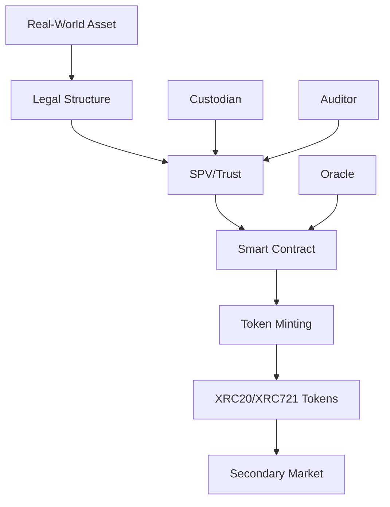

# Real-World Asset (RWA) Tokenization

XDC Network provides the infrastructure for tokenizing real-world assets, enabling fractional ownership, increased liquidity, and 24/7 trading of traditionally illiquid assets.

## What is RWA Tokenization?

RWA tokenization is the process of converting ownership rights of physical or financial assets into digital tokens on the blockchain. This enables:

- **Fractional Ownership**: Divide expensive assets into affordable shares
- **Increased Liquidity**: Trade assets 24/7 on secondary markets
- **Global Access**: Enable worldwide investment opportunities
- **Reduced Costs**: Eliminate intermediaries and paperwork
- **Transparency**: Immutable ownership records on-chain

## Supported Asset Classes

<div class="grid cards" markdown>

-   :material-office-building:{ .lg .middle } **Real Estate**

    ---

    Commercial properties, residential buildings, REITs, and land parcels.

-   :material-gold:{ .lg .middle } **Commodities**

    ---

    Precious metals (gold, silver), agricultural products, and energy resources.

-   :material-file-document:{ .lg .middle } **Financial Instruments**

    ---

    Bonds, treasury bills, private equity, and debt instruments.

-   :material-palette:{ .lg .middle } **Alternative Assets**

    ---

    Art, collectibles, intellectual property, and carbon credits.

</div>

## XDC Network Advantages for RWA

| Feature | Benefit |
|---------|---------|
| 2-second finality | Instant settlement for token transfers |
| Near-zero fees | Cost-effective for high-volume trading |
| ISO 20022 | Compliance with banking standards |
| XRC20/XRC721 | Flexible token standards |
| Private subnets | Regulatory compliance options |

## Technical Architecture



## Token Standards

### XRC20 for Fungible Assets

Best for assets where each token is identical (e.g., gold-backed tokens, fractional real estate):

```solidity
// SPDX-License-Identifier: MIT
pragma solidity ^0.8.19;

import "@openzeppelin/contracts/token/ERC20/ERC20.sol";
import "@openzeppelin/contracts/access/Ownable.sol";

contract GoldBackedToken is ERC20, Ownable {
    uint256 public goldReserve; // in grams
    uint256 public constant GRAMS_PER_TOKEN = 1; // 1 token = 1 gram of gold
    
    address public custodian;
    
    event GoldDeposited(uint256 grams, string proofHash);
    event GoldWithdrawn(uint256 grams, address recipient);
    
    constructor(address _custodian) ERC20("XDC Gold Token", "XGOLD") {
        custodian = _custodian;
    }
    
    function depositGold(uint256 grams, string calldata proofHash) external onlyOwner {
        goldReserve += grams;
        _mint(custodian, grams * 10**decimals() / GRAMS_PER_TOKEN);
        emit GoldDeposited(grams, proofHash);
    }
    
    function redeemForGold(uint256 amount) external {
        require(balanceOf(msg.sender) >= amount, "Insufficient balance");
        uint256 grams = amount * GRAMS_PER_TOKEN / 10**decimals();
        
        _burn(msg.sender, amount);
        goldReserve -= grams;
        emit GoldWithdrawn(grams, msg.sender);
    }
    
    function getGoldBacking() external view returns (uint256) {
        return goldReserve;
    }
}
```

### XRC721 for Unique Assets

Best for unique assets requiring individual identification (e.g., property deeds, art):

```solidity
// SPDX-License-Identifier: MIT
pragma solidity ^0.8.19;

import "@openzeppelin/contracts/token/ERC721/ERC721.sol";
import "@openzeppelin/contracts/token/ERC721/extensions/ERC721URIStorage.sol";

contract RealEstateToken is ERC721URIStorage {
    uint256 private _tokenIds;
    
    struct Property {
        string propertyAddress;
        uint256 squareMeters;
        uint256 valuation;
        string legalDocHash;
        bool isVerified;
    }
    
    mapping(uint256 => Property) public properties;
    
    event PropertyTokenized(uint256 tokenId, string propertyAddress, uint256 valuation);
    
    constructor() ERC721("XDC Real Estate", "XPROP") {}
    
    function tokenizeProperty(
        address owner,
        string memory propertyAddress,
        uint256 squareMeters,
        uint256 valuation,
        string memory legalDocHash,
        string memory tokenURI
    ) external returns (uint256) {
        _tokenIds++;
        uint256 newTokenId = _tokenIds;
        
        _mint(owner, newTokenId);
        _setTokenURI(newTokenId, tokenURI);
        
        properties[newTokenId] = Property({
            propertyAddress: propertyAddress,
            squareMeters: squareMeters,
            valuation: valuation,
            legalDocHash: legalDocHash,
            isVerified: false
        });
        
        emit PropertyTokenized(newTokenId, propertyAddress, valuation);
        return newTokenId;
    }
    
    function verifyProperty(uint256 tokenId) external {
        // Add verification logic (e.g., oracle, admin)
        properties[tokenId].isVerified = true;
    }
}
```

## Live RWA Projects on XDC

### Comtech Gold (CGO)
Gold-backed tokens with physical gold stored in secure vaults. Each CGO token represents 1 gram of 999.9 fine gold.

- **Website**: [comtechgold.com](https://comtechgold.com)
- **Audit**: Fully audited reserves
- **Custody**: Dubai-based secure vaults

### Trade Finance Assets
TradeFinex enables tokenization of trade receivables, invoices, and letters of credit.

- **Platform**: [tradefinex.org](https://tradefinex.org)
- **Assets**: $100M+ tokenized

## Compliance Framework

### Regulatory Considerations

1. **Securities Laws**: Ensure compliance with local securities regulations
2. **KYC/AML**: Implement identity verification
3. **Custody**: Partner with licensed custodians
4. **Audit**: Regular third-party audits
5. **Legal Structure**: Proper SPV/trust setup

### XDC Compliance Features

- **Private Subnets**: Permissioned access for regulated assets
- **Identity Layer**: KYC integration capabilities
- **Audit Trail**: Immutable transaction history
- **Programmable Compliance**: Smart contract-enforced rules

## Getting Started

### Step 1: Asset Selection
Choose suitable assets for tokenization based on:
- Liquidity needs
- Regulatory environment
- Market demand
- Operational complexity

### Step 2: Legal Structure
Work with legal advisors to:
- Create appropriate SPV/trust structure
- Draft token holder agreements
- Ensure regulatory compliance

### Step 3: Technical Implementation
Deploy smart contracts on XDC:
```bash
# Install dependencies
npm install xdc3 @openzeppelin/contracts

# Deploy to XDC testnet first
npx hardhat run scripts/deploy.js --network apothem
```

### Step 4: Launch & Distribution
- Conduct security audit
- Deploy to mainnet
- List on exchanges/DEXs
- Market to investors

## Resources

- [XRC20 Token Standard](../smartcontract/tokens.md#xrc20)
- [XRC721 NFT Standard](../smartcontract/tokens.md#xrc721)
- [Comtech Gold](https://comtechgold.com)
- [Smart Contract Deployment](../smartcontract/deployment-verification.md)
