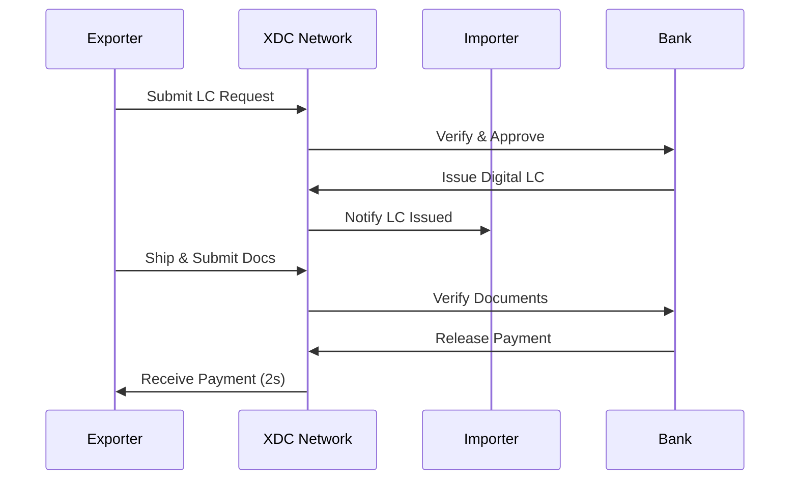

# Trade Finance on XDC Network

XDC Network is specifically designed to revolutionize the $17 trillion global trade finance industry by enabling the digitization and tokenization of trade finance instruments.

## The Trade Finance Challenge

Traditional trade finance suffers from:

- **Slow Settlement**: 5-10 days for cross-border transactions
- **High Costs**: Multiple intermediaries increase fees
- **Paper-Based**: Manual document handling creates inefficiencies
- **Limited Access**: SMEs struggle to access trade finance
- **Lack of Transparency**: Limited visibility across the supply chain

## XDC Network Solution

### Instant Settlement



### Supported Instruments

| Instrument | Traditional Time | XDC Time | Cost Reduction |
|------------|-----------------|----------|----------------|
| Letter of Credit | 5-10 days | < 1 hour | 60-80% |
| Invoice Financing | 30-90 days | < 24 hours | 50-70% |
| Bill of Lading | 5-7 days | Instant | 70-90% |
| Bank Guarantee | 3-5 days | < 1 hour | 60-80% |

## Technical Implementation

### Smart Contract Example

```solidity
// SPDX-License-Identifier: MIT
pragma solidity ^0.8.19;

contract LetterOfCredit {
    enum LCStatus { Draft, Issued, Amended, Utilized, Expired, Cancelled }
    
    struct LC {
        address issuer;
        address beneficiary;
        address applicant;
        uint256 amount;
        uint256 expiryDate;
        LCStatus status;
        bytes32 documentHash;
    }
    
    mapping(bytes32 => LC) public letterOfCredits;
    
    event LCIssued(bytes32 indexed lcId, address issuer, address beneficiary, uint256 amount);
    event LCUtilized(bytes32 indexed lcId, uint256 amount);
    
    function issueLC(
        bytes32 _lcId,
        address _beneficiary,
        address _applicant,
        uint256 _amount,
        uint256 _expiryDate
    ) external {
        letterOfCredits[_lcId] = LC({
            issuer: msg.sender,
            beneficiary: _beneficiary,
            applicant: _applicant,
            amount: _amount,
            expiryDate: _expiryDate,
            status: LCStatus.Issued,
            documentHash: bytes32(0)
        });
        
        emit LCIssued(_lcId, msg.sender, _beneficiary, _amount);
    }
    
    function submitDocuments(bytes32 _lcId, bytes32 _documentHash) external {
        LC storage lc = letterOfCredits[_lcId];
        require(msg.sender == lc.beneficiary, "Only beneficiary");
        require(lc.status == LCStatus.Issued, "LC not active");
        
        lc.documentHash = _documentHash;
    }
    
    function releasePayment(bytes32 _lcId) external {
        LC storage lc = letterOfCredits[_lcId];
        require(msg.sender == lc.issuer, "Only issuer");
        require(lc.documentHash != bytes32(0), "Documents not submitted");
        
        lc.status = LCStatus.Utilized;
        emit LCUtilized(_lcId, lc.amount);
        
        // Transfer payment logic here
    }
}
```

### Integration with xdc3.js

```javascript
const Xdc3 = require('xdc3');
const xdc3 = new Xdc3('https://rpc.xinfin.network');

// Connect to LC contract
const lcContract = new xdc3.eth.Contract(LC_ABI, LC_CONTRACT_ADDRESS);

// Issue a Letter of Credit
async function issueLC(lcId, beneficiary, applicant, amount, expiryDate) {
    const tx = await lcContract.methods.issueLC(
        lcId,
        beneficiary,
        applicant,
        xdc3.utils.toWei(amount.toString(), 'ether'),
        expiryDate
    ).send({ from: issuerAddress });
    
    console.log('LC Issued:', tx.transactionHash);
    return tx;
}

// Submit documents
async function submitDocuments(lcId, documentHash) {
    const tx = await lcContract.methods.submitDocuments(
        lcId,
        documentHash
    ).send({ from: beneficiaryAddress });
    
    return tx;
}
```

## TradeFinex Platform

[TradeFinex](https://tradefinex.org) is the flagship trade finance platform built on XDC Network, offering:

- **Peer-to-Peer Trade Finance**: Direct connection between suppliers and funders
- **Digital LC Issuance**: Fully digitized letter of credit workflow
- **Invoice Discounting**: Quick access to working capital
- **Supply Chain Finance**: End-to-end supply chain visibility

## Benefits for Stakeholders

### For Banks
- Reduced operational costs
- Faster transaction processing
- Enhanced compliance and auditability
- New revenue opportunities

### For Corporates
- Improved working capital
- Faster payment cycles
- Reduced documentation burden
- Greater transparency

### For SMEs
- Access to trade finance
- Lower costs
- Faster funding
- Simplified processes

## Case Studies

!!! example "Global Commodity Trading"
    A leading commodity trader reduced settlement time from 7 days to 2 hours using XDC-based digital LCs, saving over $2M annually in operational costs.

!!! example "Cross-Border Invoice Financing"
    An SME exporter accessed invoice financing within 24 hours instead of the typical 60-day wait, improving cash flow by 40%.

## Getting Started

1. **Review Documentation**: Understand the technical requirements
2. **Contact TradeFinex**: [tradefinex.org](https://tradefinex.org)
3. **API Integration**: Use our APIs to integrate with existing systems
4. **Pilot Program**: Start with a pilot implementation

## Resources

- [TradeFinex Platform](https://tradefinex.org)
- [XDC Trade Finance Whitepaper](https://xdc.org/whitepaper)
- [API Documentation](../api/index.md)
- [Smart Contract Templates](https://github.com/XinFinOrg)
