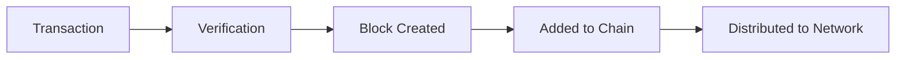

# Blockchain Basics

This guide introduces fundamental blockchain concepts for newcomers. If you're already familiar with blockchain technology, skip to [XDC Architecture](xdc-architecture.md).

## What is Blockchain?

A blockchain is a **distributed digital ledger** that records transactions across many computers. Think of it as a shared spreadsheet that:

- Everyone can read
- No single person controls
- Cannot be altered once written
- Automatically stays synchronized



## Key Concepts

### 1. Decentralization

Instead of one central server (like a bank), blockchain uses many computers (nodes) worldwide:

| Centralized | Decentralized |
|-------------|---------------|
| Single point of failure | No single point of failure |
| Trust the institution | Trust the protocol |
| Can be censored | Censorship resistant |
| Institution controls data | Users control data |

### 2. Blocks

Transactions are grouped into **blocks**. Each block contains:

- **Transactions**: The actual data being recorded
- **Timestamp**: When the block was created
- **Previous Block Hash**: Links to the prior block
- **Block Hash**: Unique identifier for this block

```
┌─────────────────────────────────┐
│           Block #100            │
├─────────────────────────────────┤
│ Previous Hash: 0x7a8b...        │
│ Timestamp: 2024-01-27 10:00:00  │
│ Transactions:                   │
│   - Alice → Bob: 10 XDC         │
│   - Carol → Dave: 5 XDC         │
│ Block Hash: 0x9f3c...           │
└─────────────────────────────────┘
           ↓
┌─────────────────────────────────┐
│           Block #101            │
├─────────────────────────────────┤
│ Previous Hash: 0x9f3c...        │
│ ...                             │
└─────────────────────────────────┘
```

### 3. Cryptographic Hashing

A **hash** is a unique fingerprint of data. Even a tiny change creates a completely different hash:

```
"Hello World" → 0x7f83b...
"Hello World!" → 0x5d41a...  (completely different!)
```

This makes tampering detectable—changing any transaction would change all subsequent hashes.

### 4. Consensus

How do all nodes agree on the "true" state of the blockchain? Through **consensus mechanisms**:

| Mechanism | How It Works | Example |
|-----------|--------------|---------|
| Proof of Work (PoW) | Solve complex puzzles | Bitcoin |
| Proof of Stake (PoS) | Stake tokens as collateral | Ethereum |
| Delegated PoS (DPoS) | Elected validators | XDC Network |

XDC uses **XDPoS** (XinFin Delegated Proof of Stake) - more on this in [XDPoS Explained](https://xinfin.org/xdpos).

### 5. Smart Contracts

**Smart contracts** are programs that run on the blockchain. They:

- Execute automatically when conditions are met
- Cannot be changed once deployed
- Are transparent and verifiable

Example: An escrow smart contract that automatically releases payment when goods are delivered.

```solidity
// Simple smart contract example
contract Escrow {
    address buyer;
    address seller;
    
    function releaseFunds() public {
        require(goodsDelivered == true);
        seller.transfer(amount);
    }
}
```

### 6. Wallets & Addresses

A **wallet** stores your private keys. An **address** is your public identifier (like an email address for crypto):

- **Private Key**: Secret! Never share. Used to sign transactions.
- **Public Key**: Derived from private key.
- **Address**: Derived from public key. Safe to share.

```
Private Key → Public Key → Address
(secret)      (derived)    (share this)

XDC Address Example: xdc71C7656EC7ab88b098defB751B7401B5f6d8976F
```

## Types of Blockchains

### Public Blockchains
- Anyone can participate
- Fully transparent
- Examples: Bitcoin, Ethereum, XDC Mainnet

### Private Blockchains
- Permissioned access
- Controlled by organization
- Examples: XDC Private Subnets

### Consortium Blockchains
- Multiple organizations share control
- Semi-private
- Example: Trade finance networks on XDC

## Why XDC Network?

XDC Network combines the best of both worlds:

| Feature | Benefit |
|---------|---------|
| **Hybrid Architecture** | Public transparency + private options |
| **Enterprise Focus** | Built for trade finance and business |
| **EVM Compatible** | Use existing Ethereum tools |
| **Fast & Cheap** | 2s blocks, < $0.0001 fees |
| **Energy Efficient** | PoS uses 99.9% less energy than PoW |

## Getting Started

Ready to explore XDC Network?

1. **Get a Wallet**: [Set up XDCPay](https://chromewebstore.google.com/detail/xdcpay/dgimfmajflciajjbhbkibdbfmpncbnmj) | [Wallet Configuration](../xdcchain/developers/wallet-configuration.md)
2. **Get Test XDC**: https://faucet.apothem.network/ | https://faucet.blocksscan.io
3. **Explore**: https://xdcscan.com | https://xdc.blocksscan.io
4. **Build**: [Developer Quick Start](../xdcchain/developers/quick-guide.md)

## Next Steps

- [XDC Architecture](xdc-architecture.md) - Deep dive into XDC's design
- [XDPoS Consensus](xdpos-explained.md) - How XDC achieves consensus
- [Gas & Fees](gas-fees.md) - Understanding transaction costs

---

!!! question "Still have questions?"
    Check our [FAQ](https://xinfin.org/faqs) or ask in [Discord](https://discord.gg/xdc).
