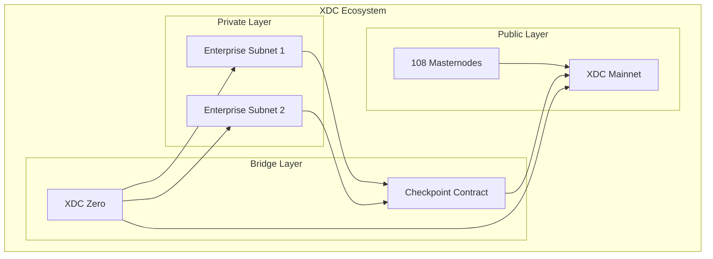
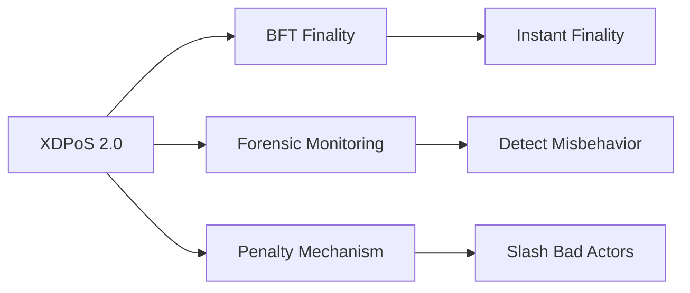
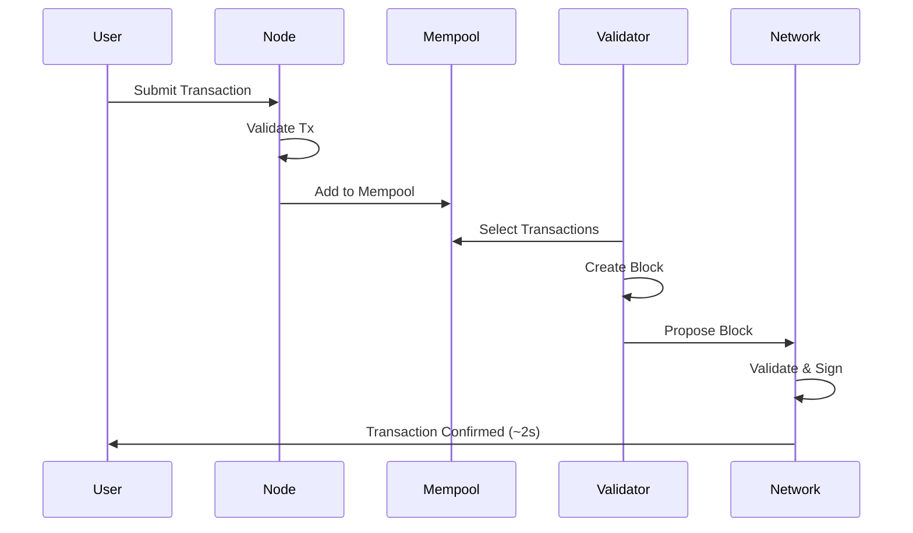

# XDC Network Architecture

This document explains the technical architecture of XDC Network, including its hybrid design, consensus mechanism, and key components.

## Overview

XDC Network is an **enterprise-grade hybrid blockchain** that combines:

- **Public Network**: Open, permissionless mainnet
- **Private Subnets**: Permissioned networks for enterprises
- **Interoperability**: Cross-chain communication between networks



## Network Layers

### Layer 1: XDC Mainnet

The public XDC mainnet is the foundation:

| Component | Description |
|-----------|-------------|
| **Chain ID** | 50 (Mainnet), 51 (Apothem Testnet) |
| **Consensus** | XDPoS 2.0 |
| **Block Time** | ~2 seconds |
| **Validators** | 108 Masternodes |
| **EVM Version** | Shanghai (latest) |

### Layer 2: Private Subnets

Enterprise-specific chains with:

- Custom consensus parameters
- Permissioned access
- Data privacy
- Mainnet checkpointing

### Bridge Layer

- **XDC Zero**: Cross-chain asset transfers
- **Checkpoint Contract**: Subnet state anchoring

## Consensus: XDPoS 2.0

XDC uses **XinFin Delegated Proof of Stake (XDPoS)** version 2.0:

### How It Works

1. **Token Holders** stake XDC to vote for Masternode candidates
2. **Top 108 Candidates** become active Masternodes
3. **Masternodes** take turns proposing blocks (round-robin)
4. **Validators** sign blocks to confirm
5. **Rewards** distributed to Masternodes and voters

### Key Features



| Feature | Description |
|---------|-------------|
| **BFT Finality** | Byzantine Fault Tolerant consensus for instant finality |
| **Forensic Monitoring** | Detects and records malicious validator behavior |
| **Slashing** | Penalties for misbehaving validators |
| **Epoch System** | 900-block epochs for validator rotation |

### Validator Requirements

| Requirement | Mainnet | Testnet |
|-------------|---------|---------|
| Minimum Stake | 10,000,000 XDC | 10,000 XDC |
| Hardware | 16GB RAM, 500GB SSD | 8GB RAM, 100GB SSD |
| Bandwidth | 100 Mbps | 50 Mbps |
| Uptime | 99.9%+ expected | - |

## Node Types

### Masternode (Validator)
- Proposes and validates blocks
- Requires 10M XDC stake
- Earns block rewards

### Standby Node
- Ready to become Masternode
- Maintains full chain state
- Can be promoted if Masternode fails

### Full Node
- Stores complete blockchain
- Serves RPC requests
- No staking required

### Archive Node
- Stores all historical states
- Required for block explorers
- Higher storage requirements

## EVM Compatibility

XDC is fully **Ethereum Virtual Machine (EVM) compatible**:

### Supported Tools

| Category | Tools |
|----------|-------|
| **Languages** | Solidity, Vyper |
| **Frameworks** | Hardhat, Truffle, Foundry |
| **Libraries** | Web3.js, Ethers.js, xdc3.js |
| **Wallets** | MetaMask, XDCPay |
| **IDEs** | Remix, VS Code |

### Migration from Ethereum

```javascript
// Ethereum code works on XDC with minimal changes

// Change 1: RPC endpoint
const web3 = new Web3('https://rpc.xinfin.network'); // XDC mainnet

// Change 2: Address format (optional)
// Ethereum: 0x71C765...
// XDC:      xdc71C765... (just prefix change)

// Everything else works the same!
const contract = new web3.eth.Contract(ABI, address);
```

## Transaction Lifecycle



### Transaction Finality

| Stage | Time | Description |
|-------|------|-------------|
| Submitted | 0s | Tx sent to node |
| Pending | 0-2s | In mempool, awaiting inclusion |
| Included | 2s | In a block |
| **Final** | 2-4s | BFT finality achieved |

## Smart Contract Execution

### Gas Model

XDC uses a gas model similar to Ethereum:

```
Transaction Cost = Gas Used × Gas Price

Example:
- Simple transfer: 21,000 gas
- Gas price: 0.25 Gwei
- Cost: 21,000 × 0.25 Gwei = 5,250 Gwei ≈ $0.00004
```

### Contract Limits

| Parameter | Value |
|-----------|-------|
| Block Gas Limit | 420,000,000 |
| Max Contract Size | 24 KB |
| Max Call Depth | 1024 |

## Security Model

### Network Security

- **108 Validators**: Distributed consensus
- **10M XDC Stake**: Economic security
- **Slashing**: Penalties for misbehavior
- **Forensic Monitoring**: Behavior tracking

### Cryptography

- **Signing**: ECDSA (secp256k1)
- **Hashing**: Keccak-256
- **Addresses**: 20-byte derived from public key

## Network Parameters

### Mainnet

| Parameter | Value |
|-----------|-------|
| Chain ID | 50 |
| Native Token | XDC |
| Block Time | ~2 seconds |
| Epoch Length | 900 blocks |
| RPC | https://rpc.xinfin.network |
| Explorer | https://xdcscan.com |
|| https://xdc.blocksscan.io |

### Apothem Testnet

| Parameter | Value |
|-----------|-------|
| Chain ID | 51 |
| Native Token | TXDC (test) |
| Block Time | ~2 seconds |
| RPC | https://rpc.apothem.network |
| Explorer | https://testnet.xdcscan.com | 
| | https://apothem.blocksscan.io |
| Faucet | https://faucet.apothem.network | 
|| https://faucet.blocksscan.io |

## Next Steps

- [XDPoS Consensus Deep Dive](https://xinfin.org/xdpos)
- [Gas & Fees](gas-fees.md)
- [Run a Node](../xdcchain/developers/node_operators/masternode.md)
- [Deploy Smart Contracts](../smartcontract/deployment-verification.md)
