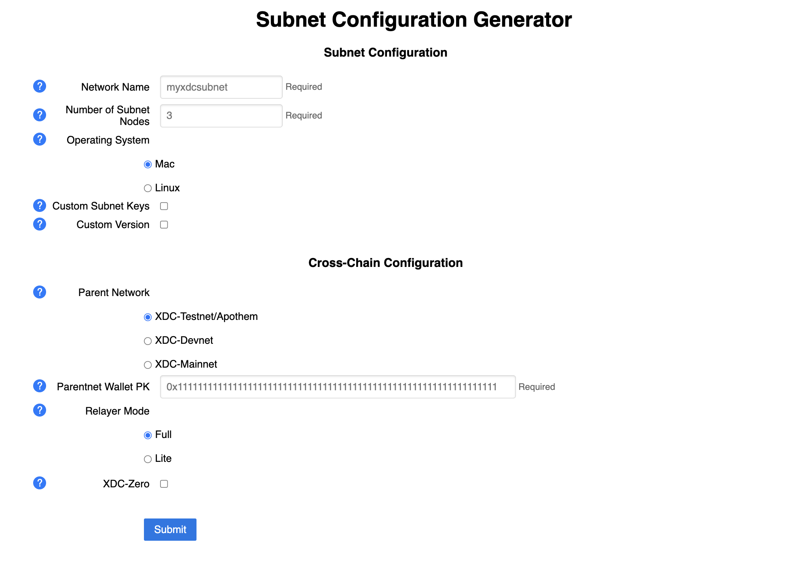
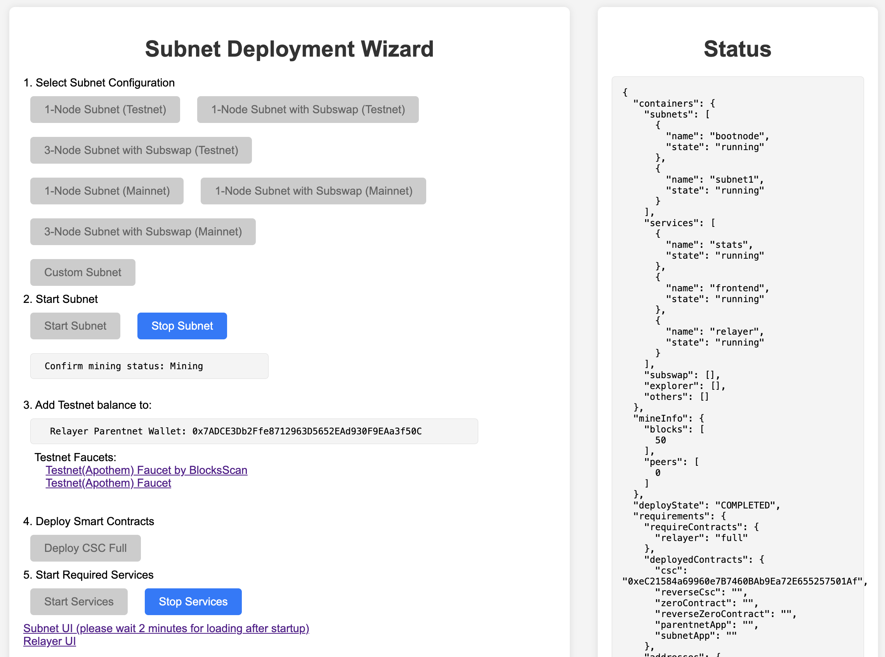

# Launch a Subnet in 10 Minutes

## Requirements
  - OS: Linux or Mac

  - docker and docker compose. For installation of docker compose please refer to: https://docs.docker.com/compose/install/linux/

  - Minimum Hardware Requirements:
    - Subnet Services:
        - CPU: 4 Core
        - Memory: 8 GB
        - Storage: 32 GB

    - Subnet Blockchain (per single Subnet node): 
        - CPU: 2 Core
        - Memory: 4 GB
        - Storage: 50 GB per year (takes up more space as blokchain grows)

  - Web3 wallet with funds. For testing we have testnet faucets:
    - https://faucet.apothem.network/ 
    - https://faucet.blocksscan.io/

## Video Walkthrough
<iframe width="768" height="432" src="https://www.youtube.com/embed/-SXsRbn6hN8" title="Setting Up Your Own XDC-Subnet Tutorial" frameborder="0" allow="accelerometer; autoplay; clipboard-write; encrypted-media; gyroscope; picture-in-picture; web-share" referrerpolicy="strict-origin-when-cross-origin" allowfullscreen></iframe>


## Deploy With Wizard UI

  1. Pull `start.sh` script from the generator Github repo and run. This will start a local webserver
  ```
  curl -O https://raw.githubusercontent.com/XinFinOrg/Subnet-Deployment/v2.0.0/container-manager/start.sh
  chmod +x start.sh
  ./start.sh
  ```
  
  2. Go to [http://localhost:5210/](http://localhost:5210) in your browser.
  <details>
  <summary>If you are running this on a remote server.</summary>
  <p>
    - if this is running on your server, first use ssh tunnel: <code>ssh -N -L localhost:5210:localhost:5210 USERNAME@IP_ADDRESS -i SERVER_KEY_FILE</code>
   <br> 
    - if you are using VSCode Remote Explorer, ssh tunnel will be available by default
  </p>
  </details>

  3. Select one of the pre-defined configs or customize your Subnet.
  

  4. Follow the UI to finish the deployment, you can also check the Status monitor of your containers:
    - Start Subnet nodes
    - Deploy cross-chain contracts
    - Start Subnet services
  

  5. Once successfully deployed, you can check out [UI usage guide](../using_subnet/using_subnet.md)
  
  <!-- 6. (Optional) if you deployed Subswap, check out the usage here: -->

### Multiple Machines Deployment

To deploy a subnet with multiple machines , access the Deployment Wizard in your browser and follow these steps:

1. Select "Custom Subnet" and click the button:
   

2. Configure the subnet options as per your requirements and fill in the details:
   

3. Click the `Submit` button. You should see a success message:
   

4. Return to the Deployment Wizard page and click the "Start" button.

5. Copy the generated files `subnetX.env`, `docker-compose.yml`, and `genesis.json` to the other machines (make sure to modify the paths as needed).

6. On `machineX`, place the `subnetX.env`, `docker-compose.yml`, and `genesis.json` files in the same directory. Then, use the following commands to start the corresponding subnet:
   ```bash
   export HOSTPWD=$(pwd)
   docker compose --profile machineX pull;  
   docker compose --profile machineX up -d;
   ```

7. Back in the Deployment Wizard, You can monitor the number of peers in the Status column on the left, or use the script `generated/scripts/check-peer.sh` to confirm if the multi-machine deployment was successful:

   

## Exposing Subnet Services and Frontend

Update the following parameters in `common.env`, replacing `<YOUR_SERVER_IP>` with your actual server IP address or domain name:
```bash
SUBNET_URL=http://<YOUR_SERVER_IP>:8545
VITE_SUBNET_URL=http://<YOUR_SERVER_IP>:5213
VITE_SUBNET_RPC=http://<YOUR_SERVER_IP>:8545
```

Modify the ports in `docker-compose.yml` as follows:
```yaml
  stats:
    ports:
      - "0.0.0.0:5213:5213"
  frontend:
    ports:
      - "0.0.0.0:5214:5214"
```

Visit the Deployment Wizard and restart the subnet and services in the Deployment Wizard to apply these settings.


<!-- ## Removing Subnet

### Shutdown Subnet
  Under `generated` directory
  ```
  docker compose --env-file docker-compose.env --profile services down 
  docker compose --env-file docker-compose.env --profile machine1 down
  ```

### Deleting Subnet 

  Remove `xdcchain*`, `bootnodes`, and `stats-service` directories
  Warning: this cannot be undone
  ``` 
  rm -rf xdcchain* bootnodes stats-service
  ``` -->
