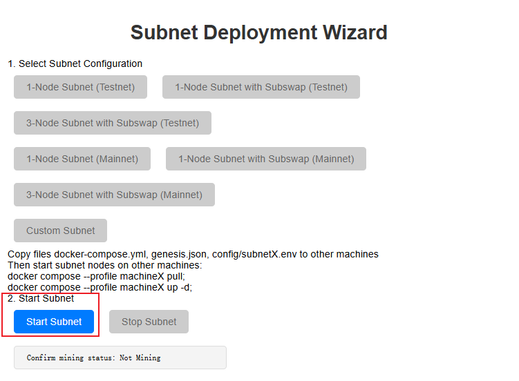
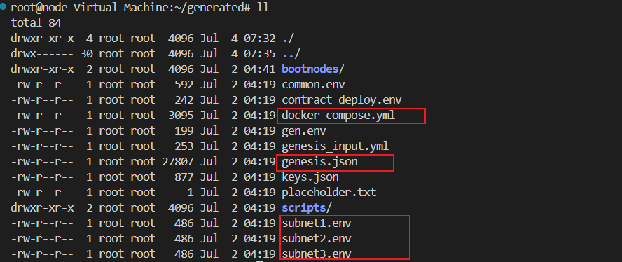
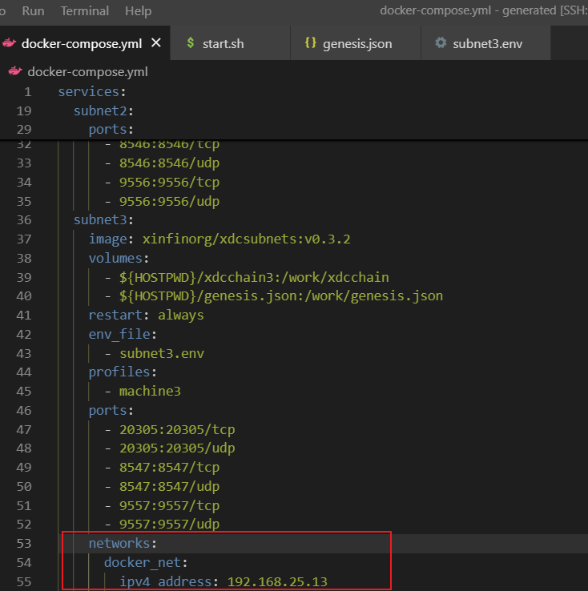
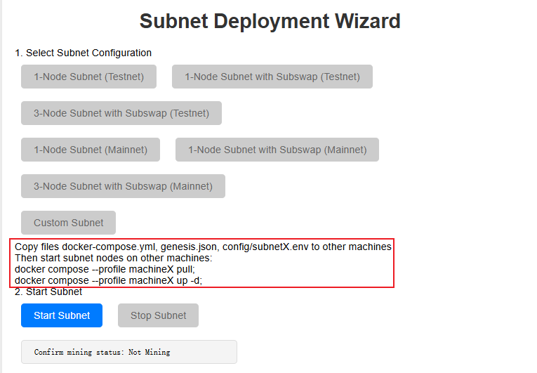

# Multiple Machines Deployment

To deploy a subnet with multiple machines, you need to follow the first two steps of [Deploy With Wizard UI](../launch_subnet/#deploy-with-wizard-ui), pull and run the `start.sh` script, access the Deployment Wizard in your browser, and follow these steps:

1. Select "Custom Subnet" and click the button:
   

2. Configure the subnet options as per your requirements and fill in the details:
   

3. Click the `Submit` button. You should see a success message:
   

4. Return to the Deployment Wizard page ,continue with [Deployment Wizard](../launch_subnet/#deploy-with-wizard-ui) step 2,click the `Start` button.
   

5. Copy the generated files `subnetX.env`, `docker-compose.yml`, and `genesis.json` to the other machines (ensure you modify the paths as necessary).
   You need to copy and move the following files:
   

6. Edit the `generated/docker-compose.yml` file, removing the subnet's network configuration (**except for the subnet configuration on machine1, which is the machine where you ran `start.sh`**).
   

7. On `machineX`, place the `subnetX.env`, `docker-compose.yml`, and `genesis.json` files in the same directory. Then, use the following commands to start the corresponding subnet:
   ```bash
   export HOSTPWD=$(pwd)
   docker compose --profile machineX pull;  
   docker compose --profile machineX up -d;
   ```
   

8. Back in the Deployment Wizard, you can monitor the number of peers in the Status column on the left, or use the script `generated/scripts/check-peer.sh` to confirm if the multi-machine deployment was successful:

   

