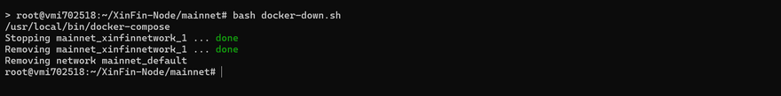
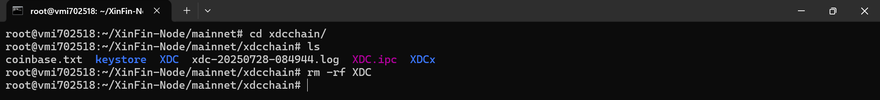
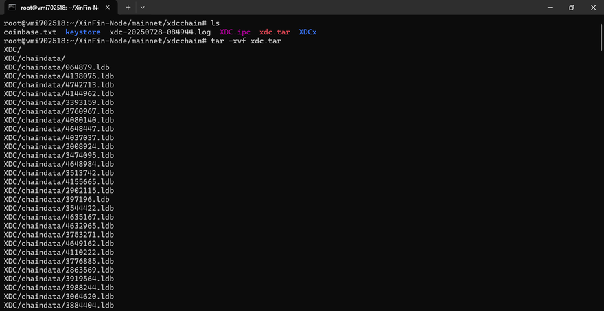
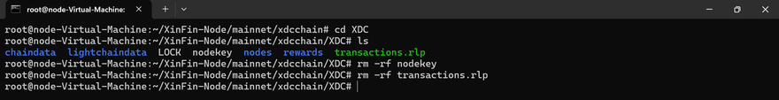

# Run a Node
Nodes are computers or servers that run an application software known as clients to perform essential tasks on a blockchain network. These tasks can include transactions, block creation, consensus, network security, and other operational tasks for the network. The tasks and functionalities a node execute depend on the type of node, with each node having different system requirements and deployment processes. This section will provide details and information on how to run and maintain nodes on the XDC Network.

# Masternodes(Full Node) and Standby Masternodes
The XDC Network runs on a globally distributed system of masternodes that participate in a [XDC 2.0](https://xinfin.org/xdpos) consensus mechanism. To enhance network integrity and security, Masternodes are required to complete a KYC process and stake 10,000,000 XDC. Masternodes can be identified as “Validator” or “Standby” Masternodes.

Standby Masternodes (or “Standby Nodes”) are identical in form and function to Validators but do not participate in validating transactions and block creation. These nodes are on standby to fill the role of Validators that drop from network participation.

# Difference between Full and Archive Node

A full node on the XDC Network is a masternode (validator or standby) that contains the most recent 128 blocks, also known as "Prunned" nodes.


An Archive node on the XDC Network is a masternode or node that contains all the data since the Genesis block.


To host an XDC Masternode/Standby node, there are specific prerequisites that you need to meet in terms of hardware, software, and staking requirements. Below is a detailed list:

## Hardware Requirements
To ensure smooth operation and optimal performance of the XDC Masternode, the following hardware specifications are recommended:

- **Processor (CPU):** 6 Core
- **Memory (RAM):** Minimum 16 GB
- **Storage (SSD):** At least 1TB SSD or NVMe (solid-state drive) to accommodate blockchain data
- **Network:** Stable internet connection with at least 1 Gbps bandwidth (upstream and downstream)
- **Operating System:** Ubuntu 22.04 LTS (recommended)

## Software Requirements
Ensure that you have the following software and dependencies installed on your server before proceeding with the XDC Masternode setup:

- **Ubuntu OS (20.04/22.04 LTS)**
- **Docker:** A containerization tool for deploying and running the masternode environment
- **Golang (Go):** For XDC node compilation and execution
- **Git:** For cloning necessary repositories
- **Firewall:** Properly configured firewall rules (allowing ports such as 30303)

## Staking Requirements
To host an XDC Masternode, a certain amount of XDC tokens must be staked. This ensures that the node operator has a vested interest in the security and performance of the network.

- **XDC Token Stake:** A minimum of **10 million XDC** tokens is required to run a Masternode. These tokens must be locked in your Masternode wallet.

## XDC Wallet Setup
You must set up an XDC wallet to manage your funds and staking:

- **XDC Wallet Address:** A valid XDC wallet address is needed to stake and manage the **10 million XDC** tokens.
- **Backup:** Ensure that you have securely backed up your wallet’s private keys or seed phrase to avoid any loss of funds.

## Securing Your XDC Network Node

Before deploying your XDC Network Node, it is critical to secure the server, especially for validator or standby nodes that do not require RPC/WebSocket access. There are two deployment scenarios:

* **RPC Node**: Exposes necessary ports to allow DApps and users to interact with the blockchain.
* **Validator/Standby Node**: Only communicates with the network and should block unnecessary ports for better security.

This guide provides instructions for securing your server, changing the default SSH port, and enabling a firewall for validator/standby nodes.

---

### Initial Server Setup

1. **Log in to your server** using credentials provided by your cloud provider:

   ```bash
   ssh user@your-server-ip
   ```

2. **Update OS packages**:

   ```bash
   sudo apt update -y && sudo apt upgrade -y && sudo apt autoremove -y
   ```

---

### Setting Up SSH Key Authentication

**Step 1: Generate SSH Key (on your local machine or computer. Not the server)**

If you don’t already have an SSH key:

```bash
ssh-keygen -t rsa -b 4096 -C "your_email@example.com"
```

* Save the key in the default path (usually `~/.ssh/id_rsa`)
* You may optionally add a passphrase or password (Recommended for highest safety)

**Step 2: Upload the Public Key to the Server**

```bash
ssh-copy-id -i ~/.ssh/id_rsa.pub user@your-server-ip
```

**Step 3: Test Login**

```bash
ssh user@your-server-ip
```

**Optional: Disable Password Authentication**

Edit the SSH config file:

```bash
sudo nano /etc/ssh/sshd_config
```

Set the following:

```
PasswordAuthentication no
```

Restart the SSH service:

```bash
sudo systemctl restart ssh
```

Keep your private key (`~/.ssh/id_rsa`) safe. You will need it for all future logins. 
**Do not upload it to the server**

---

### Locking Down Validator/Standby Nodes

If your masternode is being used only for the purpose of maintaining the XDC blockchain and does not require RPC/WebSocket access, the following hardening steps are recommended:

1. Change the default SSH port
2. Block all incoming traffic using a firewall
3. Open only the required ports (30303 for XDC P2P and your new SSH port)

---

### Change the SSH Port

1. Edit the SSH config file:

   ```bash
   sudo nano /etc/ssh/sshd_config
   ```

2. Find the line:

   ```
   #Port 22
   ```

3. Remove the `#` and change `22` to a new custom port (for example, 2222):

   ```
   Port 2222
   ```

4. Save and exit:

   * Press `CTRL+X`, then `Y`, then `ENTER`

5. Restart the SSH service:

   ```bash
   sudo systemctl restart ssh
   ```

To connect from now on:

```bash
ssh -p 2222 user@your-server-ip
```

---

### Configure UFW (Uncomplicated Firewall)

1. **Install UFW**:

   ```bash
   sudo apt install ufw
   ```

2. **Set default policies**:

   ```bash
   sudo ufw default deny incoming
   sudo ufw default allow outgoing
   ```

3. **Allow XDC P2P port**:

   ```bash
   sudo ufw allow 30303
   ```

4. **Allow your SSH port** (replace `2222` with your actual port):

   ```bash
   sudo ufw allow 2222
   ```

5. **Enable UFW**:

   ```bash
   sudo ufw enable
   ```

6. **Reboot the server**:

   ```bash
   reboot
   ```

---

### Testing Access

After rebooting, reconnect to your server using the new SSH port:

```bash
ssh -p 2222 user@your-server-ip
```

If you are unable to connect, use your VPS provider’s web console to access the server and make the necessary firewall or SSH configuration changes.

---

Once your server is secured and accessible, proceed with the standard masternode setup below.

# Setup XDC Masternode using Bootstrap Script

## For Mainnet

**Bootstrap Command for XDC Masternode Setup:**

```
sudo su -c "bash <(wget -qO- https://raw.githubusercontent.com/XinFinOrg/XinFin-Node/master/setup/bootstrap.sh)" root
```

**Examples:**
After running the bootstrap command, the system will prompt you to specify the network. To connect to the Mainnet, simply enter "mainnet". 
```
$ sudo su -c "bash <(wget -qO- https://raw.githubusercontent.com/XinFinOrg/XinFin-Node/master/setup/bootstrap.sh)" root
[sudo] password for user:
Please enter your XinFin Network (mainnet/testnet/devnet) :- mainnet
```
Next, you will be asked to input your XinFin Masternode name. Enter your desired Masternode name, such as "Demo_Server."
```
Your running network is mainnet
Please enter your XinFin MasterNode Name :- Demo_Server
Your Masternode Name is Demo_Server

```

## For Testnet
After running the bootstrap command, the system will prompt you to specify the network. To connect to the Mainnet, simply enter "testnet".
```
sudo su -c "bash <(wget -qO- https://raw.githubusercontent.com/XinFinOrg/XinFin-Node/master/setup/bootstrap.sh)" root
Please enter your XinFin Network (mainnet/testnet/devnet) :- testnet
```
Next, you will be asked to input your XinFin Masternode name. Enter your desired Masternode name, such as "test01"
```
Your running network is testnet
Please enter your XinFin MasterNode Name :- test01
Your Masternode Name is test01
```

## For Devnet
After running the bootstrap command, the system will prompt you to specify the network. To connect to the Mainnet, simply enter "devnet".
```
sudo su -c "bash <(wget -qO- https://raw.githubusercontent.com/XinFinOrg/XinFin-Node/master/setup/bootstrap.sh)" root
Please enter your XinFin Network (mainnet/testnet/devnet) :- devnet
Your running network is devnet
```
Next, you will be asked to input your XinFin Masternode name. Enter your desired Masternode name, such as "test01"
```
Please enter your XinFin MasterNode Name :- test01
Your Masternode Name is test01
Generate new private key and wallet address.
If you have your own key, you can change after this and restart the node
Type 'Y' or 'y' to continue:
```
---------------------------------------------------------------


# How to Stake XDC on a Masternode/Standby node

### Prerequisites
To stake XDC and run a masternode, you will need the following:

- XDCPay, XinFin Web Wallet, or a hardware wallet (Trezor supported)
- 10,000,000 XDC (mainnet tokens) or test XDC (for the Apothem testnet)
- Your coinbase address (retrievable from your masternode)

**Note:** You do not need 10,000,000 XDC to run a node solely for RPC queries or accessing live data from the blockchain. This guide covers staking for masternode candidates.


## Step-by-Step Process to Stake Your XDC Node

### 1. Access the Staking Platform

- Visit [XinFin Masternode](https://master.xinfin.network/) page.
- Select either the **Mainnet** (for real staking) or **Apothem** (for testnet staking).

### 2. Log In to Your Wallet

- Click on the **Login** button on the masternode page.
- You’ll be presented with multiple login options, including XDCPay, WalletConnect v2, Private Key/Mnemonic, Ledger Wallet or Trezor.
- For this guide, we'll use XDCPay:
  - Open XDCPay and ensure you are connected to either the Mainnet or Apothem network.
  - Log in to your wallet using XDCPay.

### 3. Become a Masternode Candidate

- Once logged in, click the **Become a Candidate** button on the dashboard.
- A new screen will appear where you will enter your KYC (Know Your Customer) information.
- KYC Process:
    - Upload your required KYC documents (you can find downloadable templates linked in the form).
    - Once uploaded, the system will show a "KYC True" status, indicating your KYC has been approved.

### 4. Enter Your Coinbase Address

- After completing KYC, input your **Coinbase address**. This address is specific to your masternode and can be retrieved by logging into your node.

### 5. Confirm and Apply for Staking

- Click on **Apply** to stake your XDC and become a masternode candidate.
- Your XDCPay wallet will prompt you to **sign the transaction**. Review the details and click Confirm.

### 6. Transaction Confirmation

- After confirming, your staking transaction will be processed. Once successful, you’ll receive a notification in the bottom-right corner of the screen.
- To verify the transaction, navigate to your XDCPay wallet, click on **Transactions**, and look for the **Propose** event. This event confirms your candidacy as a masternode.

---------------------------------------------------------------

# Setup XDC Masternode/Standby node using One-Click Installer

### Method 1: Setup XinFin’s XDC Masternode One-click Installer ###

To qualify for Masternode on XinFin Network, you need at least **10,000,000 XDC, for the long term.**


**Operating System**:

* Apple Mac
* Windows
* Linux - Ubuntu

## Step 1: 
**Download [XDC One-Click Installer](https://xinfin.org/setup-masternode) (to setup Masternode) for Windows, Linux, and Mac OS and Install on your local machine.**

## Step 2: 
**Now Run the One Click Installer, Make sure you read the Terms properly then click on I Agree button.**

* **"C:\Program Files\XinFin-Network"** this will be your destination folder and this **"C:\Users\...\AppData\Roaming\XDCChain"** will contain your Keystore folder.
* Make sure, you create a backup of your Keystore folder.
* Now click on "XinFin Network" One click installer.
* You can see the address of One Click Installer in left side, Also you can change the Network.
* For changing the Network, click on "Develop" then select "Network" (XinFin - Main Network/ XinFin Apothem Network)
* You can check the Node status under the **[stats.xinfin.network](http://stats.xinfin.network/)**


**Step 3: Create a wallet for Masternode**

* Create your wallet address with Mnemonic Phrase or with Keystore. We always recommend to use Keystore for running a Masternode.
* Enter a strong password while creating the wallet.
* **Don't lose your Keystore file**
* **Don't share it with anyone**
* **Always take a backup of your Keystore file.**
* **If you lose it, all your funds will get locked.**
* After creating backup, Download your Keystore file.
* Now Access your wallet with Keystore and enter a valid password properly to access your wallet.
* If you are hosting a Masternode on Testnet then copy the Wallet address and paste it on **[XDC Faucet](https://faucet.apothem.network/)** for the Testnet XDC


**Step 4: Host your Masternode**

* For hosting the Masternode, you need to copy the private key and login the Masternode.
* For uploading the KYC, click on the "Become a Masternode"
* Check the KYC criteria, the KYC file should be in pdf format only.
* Once you upload your KYC, you need to enter the "Coinbase Address" which is in One Click Installer after that click on Apply button.
* Now you will be notify with sucessful toaster i.e **"You have successfully applied for Masternode"**
* You can check all the status regarding your Masternode here: **[master.apothem.network](https://master.apothem.network/)**.

---------------------------------------------------------------

# Setup XDC Masternode/Standby node using Docker

## Setting up XDC Network Masternode Docker version

The server or VPS used for the masternode should be directly facing the internet with a public IP and without NAT. 


**Operating System**: Ubuntu 20.04 64-bit or higher

Should be facing internet directly with **public IP** & **without NAT**

**Tools**: Docker, Docker Compose(1.27.4+)

Setup (For Ubuntu 20.04 64-bit or higher Operating System)

Follow the written steps starting from step 1, or you can watch the video tutorials:

<iframe width="768" height="432" src="https://www.youtube.com/embed/1A20eVTJYvs" title="Deploying an XDC Network Masternode via Docker" frameborder="0" allow="accelerometer; autoplay; clipboard-write; encrypted-media; gyroscope; picture-in-picture; web-share" referrerpolicy="strict-origin-when-cross-origin" allowfullscreen></iframe>

## Step 1: Clone repository
```bash
git clone https://github.com/XinFinOrg/XinFin-Node.git

```

## Step 2: Change directory
Then we change the directory to XinFin-Node
```bash
cd XinFin-Node
```

## Step 3: Install docker
We need to install Docker and Docker-Compose by running the following command:
```bash
sudo ./setup/install_docker.sh
```

## Step 4: 
Create a new .env file and copy the env.example file that exist in the mainnet directory. We will ensure we are in the "mainnet" directory by typing these commands. Once in edit mode for the .env file, name your masternode and use an email address in the respective fields
```bash
cd mainnet
cp env.example .env
nano .env 

```
**For Testnet**
```bash
cd testnet
cp env.example .env
nano .env
```

## Step 5: Start your Node
**For Mainnet run the following commands:**
```bash
cd mainnet
sudo docker-compose -f docker-compose.yml up -d
```
At this point you should be able to see your masternode on the list of nodes here or as shown below:


For Testnet run the following commands:
```bash
cd testnet
sudo docker-compose -f docker-compose.yml up -d
```
You should be able to see your node listed on the [Apothem Network] page. Select **"Switch to LiveNet"** to check **LiveNetwork** Stats and Select **"Switch to TestNet"** for **TestNetwork**.

Your coinbase address can be found in xdcchain/coinbase.txt file.

For troubleshooting purposes, you can stop the node by using the following command on either Mainnet or Testnet:
```bash
sudo docker-compose -f docker-compose.yml down
```

---------------------------------------------------------------

# Setup XDC Masternode(Full Node)/Standby node using Snapshots

### Prerequisites

* A server or cloud instance (minimum 16 GB RAM, 1.5 TB storage)
* Ubuntuoperating system
* Basic Linux command-line knowledge

### Setting up the Node Environment using Bootstrap

Its the primary options for setting up your XDC Network node environment: using the bootstrap.sh script for a quick setup

Using the Bootstrap Command for Quick Setup
This command automates the installation of necessary dependencies and sets up the basic node environment.

```
sudo su -c "bash <(wget -qO- https://raw.githubusercontent.com/XinFinOrg/XinFin-Node/master/setup/bootstrap.sh)" root
```

**You will be prompted to enter:**

- **XinFin Network (mainnet/testnet/devnet):** Type mainnet for the main XDC Network.

- **XinFin MasterNode Name:** Provide a name for your node (e.g.,Rushabh-Snapshot-Node).

- **Generate new private key and wallet address:** If you have your own key, you can change after this and restart the node: Enter y or Y and continue.


Once the installation on your Ubuntu server is complete, attach to the node using the following command to verify that the blockchain synchronization has begun

```
bash xdc-attach.sh
```


You can monitor the status of your node using the above command or by visiting the official stats page at https://xinfin.network/#stats Once you've confirmed that the node has begun syncing from the genesis block, stop the node by running:

```
bash docker-down.sh
```


After stopping your node, proceed to delete the existing XDC directory to prepare for the snapshot data



After deleting the XDC folder, you can now proceed to download and apply the latest snapshot.

To download the XDC Network Mainnet snapshot, use the appropriate command based on the type of node you’re setting up:

- **For a Full Node (latest state only):** https://rpc.xdc.network/snapshots/mainnet/full/

- **For an Archive Node (complete history):** https://rpc.xdc.network/snapshots/mainnet/archive/

**Note: Snapshots are updated approximately every 20 days at https://rpc.xdc.network/snapshots/**


Once the xdc.tar file has been downloaded, extract the snapshot by running the following command:

```
tar -xvzf xdc.tar
```

This will unpack the archive and create the XDC directory containing the necessary blockchain data.



### Once the XDC folder has been extracted, navigate into it and perform the following cleanup steps:

**Delete the nodekey file:**

```
rm -rf nodekey
```

**Delete the transactions.rlp file:**

```
rm -rf transactions.rlp
```



---------------------------------------------------------------

# Downloading a Network Snapshot (Mainnet or Apothem)

The following steps are to expedite the syncing process of your node with the XDC Network.  If you followed the steps above, your node will take 3-4 days to sync up with the network fully.  You can reduce that time by downloading a network snapshot and bringing your node back up after the chain has been downloaded and unpacked. 

<iframe width="768" height="432" src="https://www.youtube.com/embed/ZQF3f0Zd6-k" title="Downloading an XDC Network Snapshot to Expedite Node Syncing to" frameborder="0" allow="accelerometer; autoplay; clipboard-write; encrypted-media; gyroscope; picture-in-picture; web-share" referrerpolicy="strict-origin-when-cross-origin" allowfullscreen></iframe>

# Mainnet Snapshot

**Bring down your node:**
```bash
sudo docker-compose -f docker-compose.yml down
```
**Remove the old xdchain file from the server**
```bash
rm -rf xdcchain.tar
```
**Download the snapshot** 
```bash
wget https://download.xinfin.network/xdcchain.tar
```
**Unpack the xdcchain.tar file**
```bash
tar -xvzf xdcchain.tar
```
**The unpacking will take some time, and it will look like this:**


**The following command will move the xdcchain/XDC to xdcchain/XDC_backup**
```bash
mv  xdcchain/XDC xdcchain/XDC_backup
mv XDC xdcchain
```

**Then we are going to remove the old "nodekey" file**
```bash
rm -rf xdcchain/XDC/nodekey
```

**The last step is to run the bash upgrade.sh command**
```bash
bash upgrade.sh
```

This command will bring your node up and it will start syncing to the network. Once up and running, your node will be synced to the network in just a few minutes. 


# Apothem Snapshot

**Bring down your node:** 
```bash
sudo docker-compose -f docker-compose.yml down
```

**Remove the old xdchain file from the server**
```bash
rm -rf apothem.tar
```

**Download the snapshot**

Full Node snapshot: 
```bash
wget http://downloads.apothem.network/xdcchain.tar
```

Archive Node snapshot: 
```bash
wget http://downloads.apothem.network/xdcchain_archive.tar
```

**Unpack the apothem.tar  file**
```bash
tar -xvzf apothem.tar
```

**Move the xdcchain-testnet**
```bash
mv XDC xdcchain-testnet
```

**Bring up the node**
```bash
sudo docker-compose -f docker-compose.yml up -d
```


<!-- 
## Validator Masternode
Validator Masternodes operate and participate in XDC Network’s DPoS consensus engine, validating transactions and block creation. 

## Standby Masternodes
Standby Masternodes (or “Standby Nodes”) are identical in form and function to Validators but do not participate in validating transactions and block creation. These nodes are on standby to fill the role of Validators that drop from network participation.

# Full Node
Full nodes do not participate in block creation or validating transactions like Masternodes so staking and KYC is not required. These nodes can be used to provide the state of the blockchain, transaction history, or as an RPC. A complete state and history can be provided up to the previous 128 blocks, and block header only after the previous 128 blocks to genesis. 

# Archive Node
This type of node is used to query data, providing everything in the full node plus complete blockchain and state history to genesis. An archive node would be used if details beyond block header are needed, such as account balances and data stored in blocks. These nodes do not have the same functionality or requirements as Masternodes -->
