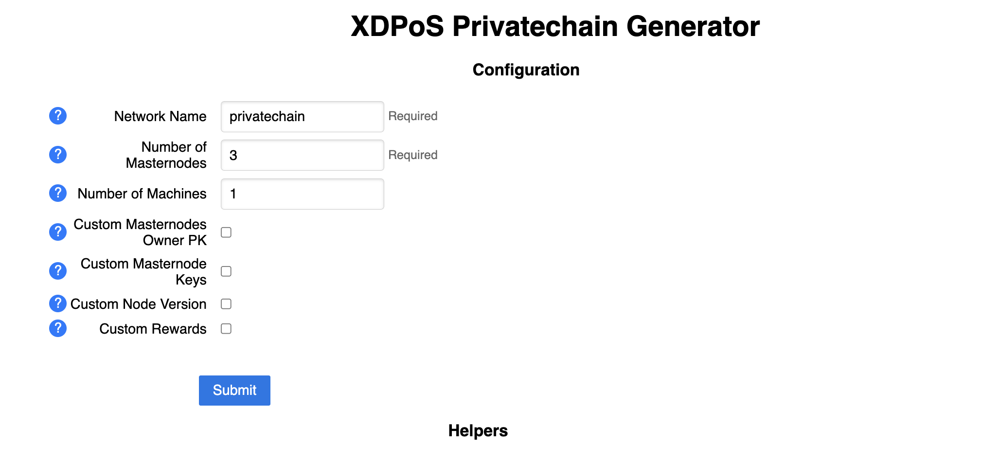

# Deploy Private Blockchain With XDC2.0 Consensus

## Deploy With Wizard UI

  1. Pull `start.sh` script from the generator Github repo and run. This will start a local webserver.
  ```
  curl -O https://raw.githubusercontent.com/XinFinOrg/Subnet-Deployment/v2.1.0/container-manager/start_xdpos.sh
  chmod +x start_xdpos.sh
  ./start_xdpos.sh
  ```
  
  2. Go to [http://localhost:5210/](http://localhost:5210) in your browser.
  <details>
  <summary>If you are running this on a remote server.</summary>
  <p>
    - if this is running on your server, first use ssh tunnel: <code>ssh -N -L localhost:5210:localhost:5210 USERNAME@IP_ADDRESS -i SERVER_KEY_FILE</code>
   <br> 
    - if you are using VSCode Remote Explorer, ssh tunnel will be available by default
  </p>
  </details>

  3. Input your desired configuration.
  

  4. Submit and continue in your terminal with the below command. 
  ```
  cd generated;
  ./docker-up.sh machine1;
  ```
  
  5. Confirm the private blockchain is working correcly by running check scripts.
  ```
  ./scripts/check-peer.sh 
  ```
  
  ```
  ./scripts/check-mining.sh 
  ```
  